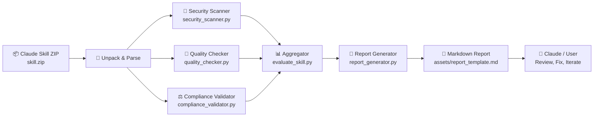

# 🧠 Skill Evaluator  
**Comprehensive Evaluation Toolkit for AI Skills (Claude-Compatible)**  

[](https://www.python.org/)

[](LICENSE)


---

## 📘 Overview

**Skill Evaluator** is a toolkit for auditing and evaluating **Claude-compatible skills** across four critical dimensions:

- 🔐 **Security** – detect insecure patterns, unguarded calls, and risky integrations  
- 📏 **Quality** – enforce structure, clarity, and robustness of prompts & logic  
- 🧰 **Utility** – ensure the skill actually solves a well-defined user problem  
- ⚖️ **Compliance** – align with safety & ethical guidelines before deployment  

It is designed for:

- **Skill engineers & prompt architects**
- **AI safety reviewers & red-teamers**
- **Consultants and power users building Claude skills at scale**

Use it as a **pre-publish gate** before you ship a new skill, or as a **post-hoc auditor** on an existing skill library.

---

## 🧩 Repository Structure

Top-level:

```text
skill-evaluator/
├── .claude/                     # Local Claude config / plugin metadata
├── skill-evaluator/             # Core evaluation toolkit (Python + docs)
├── skill-evaluator.zip          # Zipped plugin bundle for direct installation
├── RELEASE_NOTES_v1.2.md        # Historical release notes
├── RELEASE_NOTES_v1.2.2.md      # Latest release notes
├── bash.exe.stackdump           # Debug artifact from earlier local runs
└── 2025-11-06-*.txt             # Session / progress log
````

Core toolkit folder:

```text
skill-evaluator/
├── assets/
│   └── report_template.md       # Base template for evaluation reports
├── references/
│   ├── compliance_checklist.md  # Compliance criteria & checks
│   ├── evaluation_methodology.md# How scoring & auditing works
│   ├── quality_criteria.md      # Quality thresholds & grading rubric
│   └── security_patterns.md     # Known secure/insecure patterns
├── scripts/
│   ├── compliance_validator.py  # Compliance evaluation logic
│   ├── evaluate_skill.py        # Orchestrator: runs full evaluation
│   ├── quality_checker.py       # Quality-focused checks
│   ├── report_generator.py      # Builds the final Markdown report
│   └── security_scanner.py      # Static security scanning
├── LICENSE
├── SKILL.md                     # Claude skill definition metadata
├── USER_GUIDE.md                # User-facing usage guide
└── DEVELOPMENT_NOTES.md / ...   # Future enhancements, roadmap, notes
```

---

## 🧰 Tech & Tool Stack

| Category        | Technology / Approach                                                |
| --------------- | -------------------------------------------------------------------- |
| **Language**    | Python 3.10+                                                         |
| **Execution**   | Claude plugin, local Python, ZIP bundle                              |
| **I/O Formats** | ZIP (skills), Markdown reports, text logs                            |
| **Security**    | Pattern-based scanning, safe-usage rules, static analysis heuristics |
| **Docs**        | Markdown (`USER_GUIDE.md`, `SKILL.md`, `references/*`)               |
| **VCS**         | Git + GitHub                                                         |
| **OS Support**  | Windows, macOS, Linux (via Claude Desktop + Python)                  |

---

## 🔍 Architecture Overview

The Skill Evaluator follows a **simple but opinionated pipeline**:



**Key ideas:**

* Each dimension (**Security**, **Quality**, **Compliance**) is handled by a dedicated script.
* `evaluate_skill.py` orchestrates the pipeline and aggregates results.
* `report_generator.py` renders a human-readable Markdown report using `assets/report_template.md`.
* The output report is designed to be dropped directly into Claude or Git-based reviews.

---

## 🚀 Getting Started

### 1️⃣ Clone the Repository

```bash
git clone https://github.com/emcdo411/skill-evaluator.git
cd skill-evaluator
```

### 2️⃣ (Optional) Create a Virtual Environment

```bash
python -m venv venv
# Windows
venv\Scripts\activate
# macOS / Linux
source venv/bin/activate
```

### 3️⃣ Install Dependencies

Inside the **inner** `skill-evaluator` folder:

```bash
cd skill-evaluator
pip install -r requirements.txt
```

> If you're using this purely as a **Claude plugin**, Claude may handle its own environment. The `requirements.txt` is mainly for local development and advanced customization.

---

## 🧪 Usage

### A. As a Claude Plugin (Recommended)

1. Copy the plugin folder to Claude’s plugin directory (Windows example):

   ```powershell
   xcopy /E /I ".\skill-evaluator" "$env:USERPROFILE\.claude\plugins\skill-evaluator"
   ```

2. Restart Claude Desktop (if needed).

3. From inside Claude, run commands like:

   ```text
   /skill-evaluator path\to\your-skill.zip
   ```

   Example modes (depending on how you wire it in `SKILL.md`):

   ```text
   /skill-evaluator --security-only path\to\skill.zip
   /skill-evaluator --pre-publish path\to\skill.zip
   /skill-evaluator --full path\to\skill.zip
   ```

### B. From Local Python (Advanced / Dev Mode)

From within the inner `skill-evaluator` folder:

```bash
python scripts/evaluate_skill.py path/to/skill.zip
```

This will:

* Unpack `skill.zip`
* Run the security, quality, and compliance checks
* Generate a Markdown report (typically in an `output` or `reports` folder, depending on config)

---

## 🧮 Evaluation Dimensions

### 🔐 Security

* Flags dangerous patterns (e.g., unchecked external calls, `eval`-style logic if present)
* Encourages **principle of least privilege** and clear guardrails
* Uses `references/security_patterns.md` as a living knowledge base

### 📏 Quality

* Validates file structure and required metadata fields
* Encourages clear, well-structured prompts and error handling
* Uses `references/quality_criteria.md` as a rubric

### ⚖️ Compliance

* Checks alignment with high-level safety expectations
* Looks for missing disclaimers, unclear user boundaries, or risky capabilities
* Backed by `references/compliance_checklist.md` & `evaluation_methodology.md`

---

## 🧭 Roadmap

* [ ] Add JSON / YAML output for dashboards (e.g., Streamlit, RShiny, Plotly, PowerBI)
* [ ] Integrate with CI (GitHub Actions) to auto-evaluate skills on PRs
* [ ] Add severity scoring and letter-grade output for quick triage
* [ ] Optional API mode for use by external tools
* [ ] Visualization dashboard for evaluation history & trend analysis

---

## 👥 Contributors

| Name                       | Role                        | Profile                                                    |
| -------------------------- | --------------------------- | ---------------------------------------------------------- |
| **bjulius**                | Original creator / author   | [https://github.com/bjulius](https://github.com/bjulius)   |
| **Claude (Anthropic)**     | AI-assisted code generation | N/A                                                        |
| **Erwin Maurice McDonald** | Maintainer / AI strategist  | [https://github.com/emcdo411](https://github.com/emcdo411) |

> This fork preserves the original intent while positioning the tool within a broader AI governance and evaluation toolkit.

---

## 🪪 License

This project is licensed under the **MIT License**.
See [LICENSE](LICENSE) for the full text.

---

## 🌐 Related Docs

* 📄 [USER_GUIDE.md](./skill-evaluator/USER_GUIDE.md)
* 🧾 [SKILL.md](./skill-evaluator/SKILL.md)
* 📚 [Evaluation Methodology](./skill-evaluator/references/evaluation_methodology.md)
* ✅ [Compliance Checklist](./skill-evaluator/references/compliance_checklist.md)

---

### 💡 Maintained by [Erwin Maurice McDonald](https://www.linkedin.com/in/mauricemcdonald)

> *“Measure what matters — in AI, quality and safety are features, not afterthoughts.”*

